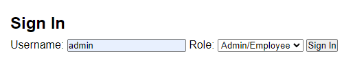
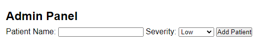
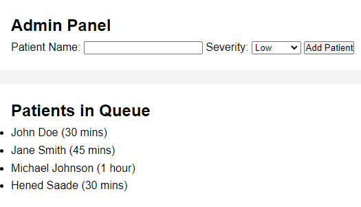
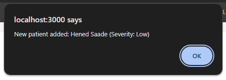
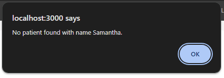
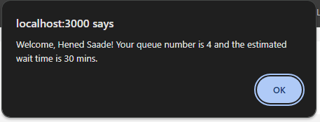

# How to run application:

*Before starting, make sure to have Node.js installed (any version will do)*

**Step 1: Install dependencies**

Go to the project directory in command prompt and then run:

    npm init -y

**Step 2: Install Express.js:**

    npm install express

**Step 3: Run the server:**

    node server.js

# Admin View:

Firstly, there is a sign in box, you have to select the "Admin/Employee" option and enter "admin"

Once logged in, you will be able to see the "Add Patients" section

After entering a patient's name and severity, you will see that patient's name populated in the "Patients in Queue' table right below:

Furthermore, you get a pop-up confirming the patient add-in:

# Patient View:

The patient will only be able to see the "Patients in Queue" table and the sign in feature. 

If they try to sign in and their name isn't in the queue, we get this pop-up:

However, if your name is in queue, you will get this pop-up after a successful sign in:

 